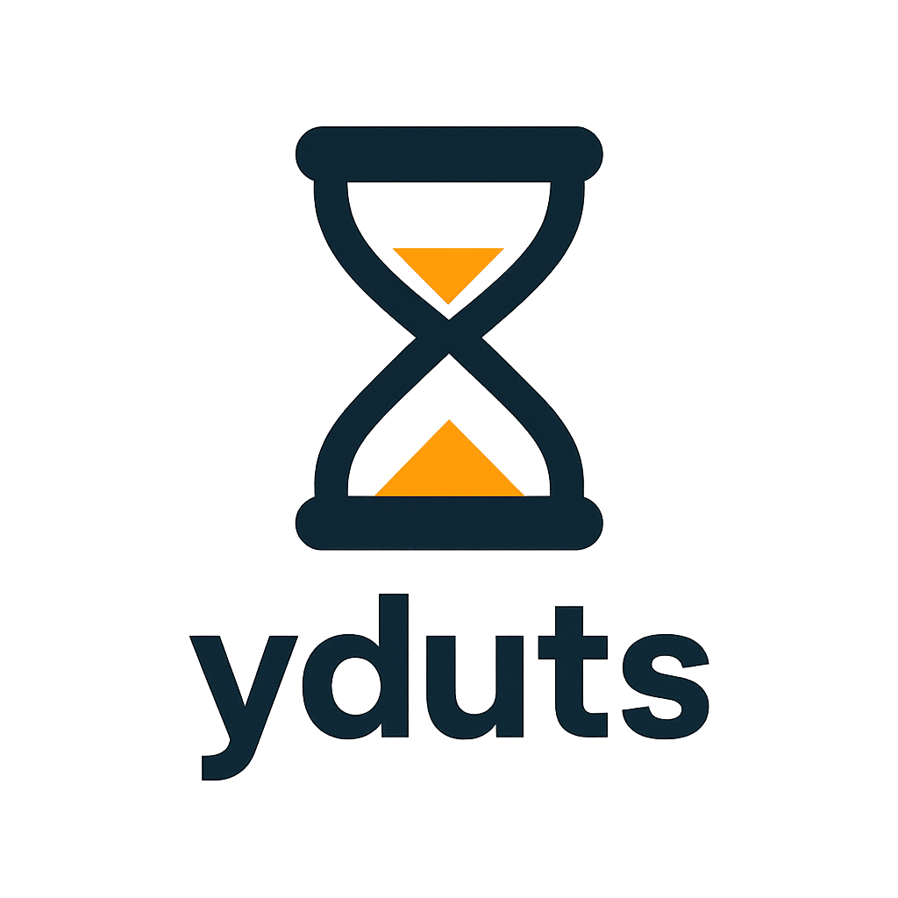

<div align="center">
  
  
  <p><i>A minimal, distraction-free CLI study timer for Linux</i></p>
  
  [](https://opensource.org/licenses/MIT)
  [](https://www.gnu.org/software/bash/)
  [](https://www.linux.org/)
  
</div>

---

## What It Does

**yduts** helps you stay focused by managing timed study sessions directly from your terminal:

- Set timed study sessions with a single command
- Automatically pause notifications during focus time (dunst/mako/swaync)
- Track your study time and progress with a visual progress bar
- Log completed sessions for statistics and insights

Perfect for students, developers, and anyone who values focused work time.

Read the personal theory here: [Why I Built yduts](docs/theory.md)

---

## Installation

```bash
git clone https://github.com/saeeedhany/yduts.git
cd yduts
./install.sh
```

The installer will:
- Install to `~/.local/share/study`
- Create a symlink in `~/.local/bin/study`
- Guide you through PATH setup if needed

---

## Usage

```bash
# Start a study session
study start "Mathematics" 1h30m
study start "Reading" 45m

# Check progress
study status

# Stop early
study stop

# View statistics
study stats

# Pause/Resume 
study start "Math" 1h      # Start session
study pause                # Pause (saves elapsed time)
study resume               # Continue from where you left off

# Pomodoro Mode
study pomodoro "Physics" 25m 5m    # 25min work, 5min break
study pomodoro "Reading"           # Defaults: 25m work, 5m break
study pomodoro "Coding" 50m 10m    # Custom durations
```

### Duration Formats
- `1h30m` - 1 hour 30 minutes
- `45m` - 45 minutes  
- `2h` - 2 hours
- `30m15s` - 30 minutes 15 seconds

---

## Features

- [x] **Focus Mode** - Auto-pause notifications during study sessions  
- [x] **Progress Tracking** - Real-time status with visual progress bar  
- [x] **Session Logging** - CSV logs for all completed sessions  
- [x] **Statistics** - View total time, completed sessions, and daily progress  
- [x] **Lightweight** - Pure Bash, minimal dependencies  
- [x] **Pomodoro Mode** - Automated work/break cycles  🎉 New Feature
- [x] **Pause/Resume** - Pause sessions and resume later  🎉 New Feature

---

## Requirements

- Bash 4.0+
- `notify-send` (optional, for notifications)
- `dunst` or `mako` or `swaync` (optional, for focus mode)

---

## Configuration

Edit `~/.local/share/study/config/settings.conf` to customize:

- Enable/disable focus mode
- Change notification daemon commands
- Adjust notification preferences
- Customize file paths

---

## Roadmap

Planned features for future releases:

- [ ] **Daily Goals** - Set and track daily study goals
- [ ] **Streaks** - Track consecutive study days
- [ ] **Topic Analytics** - Per-topic statistics and insights
- [ ] **Session Templates** - Save and reuse common study sessions
- [ ] **Break Reminders** - Notifications during long sessions
- [ ] **Session Notes** - Add notes after completing sessions
- [ ] **Tags** - Tag sessions for better organization
- [ ] **Export Reports** - JSON/Markdown export for logs
- [ ] **Interactive History** - Browse past sessions
- [ ] **Session Scheduling** - Schedule future study sessions

---

## Uninstall

```bash
cd yduts
./uninstall.sh
```

Your logs will be backed up automatically before removal.

---

## Color Palette

The **yduts** brand uses:

- **Primary:** `#2C3E50` (Dark Navy) - Main brand color
- **Accent:** `#F39C12` (Amber Orange) - Active states and highlights
- **Text:** `#1A1A1A` (Near Black) - Body text
- **Background:** `#FFFFFF` (White) - Default background

---

## License

MIT License - See [LICENSE](LICENSE) file for details

---

## Contributing

Contributions are welcome! Feel free to:
- Report bugs or request features via [Issues](https://github.com/saeeedhany/yduts/issues)
- Submit pull requests
- Suggest improvements

---

<div align="center">
  <p><b>Happy studying!</b> ⏱️</p>
  <p><i>Made with focus by <a href="https://github.com/saeeedhany">saeeedhany</a></i></p>
</div>
